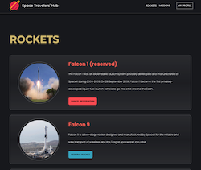
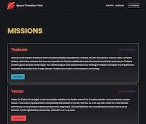

# Space Travelers' Hub

> This web app works with the real live data from the SpaceX API. It is for a company (not a real one) that provides commercial and scientific space travel services. The application allows users to book rockets and join selected space missions.

 

## Built With

- Major languages: HTML CSS/SASS JS 
- Frameworks: React/Redux Jest
- Technologies VSC, Git, GitHub, Gitflow, Chrome

## Live Demo (if available)

[Live Demo Link](https://62d9a6fbda5ea308bbf1646b--frolicking-kataifi-133879.netlify.app/)

## Getting Started

To get a local copy up and running, follow these simple example steps.

### Prerequisites
code editor and browser

### Install
`npm i`

### Usage
use the calculator by clicking on its buttons.

### Run tests
`npm test`

### Deployment
`npm start`

## Authors

👤 **Giuseppe Tomasini**

- GitHub: [@GiuseppeTG](https://github.com/GiuseppeTG)
- Twitter: [@giusetomasini](https://twitter.com/giusetomasini)
- LinkedIn: [Giuseppe Tomasini](https://www.linkedin.com/in/giuseppe-tomasini-67ba101a8/)

👤 **Fabien**

- GitHub: [@fibini](https://github.com/fibini)
- Twitter: [@Onenewpage1](https://twitter.com/Onenewpage1)
- LinkedIn: [fabien brathwaite](https://www.linkedin.com/in/fabien-brathwaite/)

## 🤝 Contributing

Contributions, issues, and feature requests are welcome!

Feel free to check the [issues page](../../issues/).

## Show your support

Give a ⭐️ if you like this project!

## 📝 License

This project is [MIT](./MIT.md) licensed.
